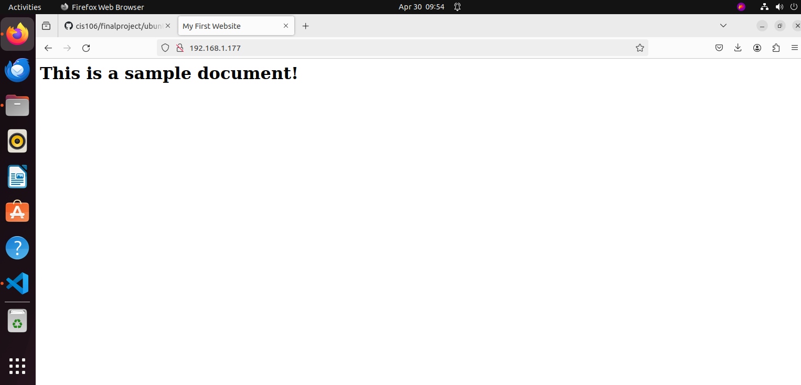
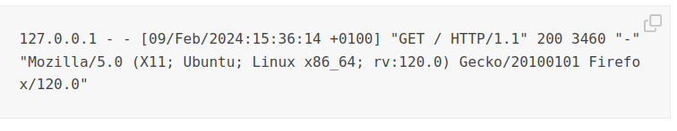

# Deliverable 2 Submission 

## Server Specifications

## Ubuntu Login 

## My First Website 

### What is the IP address of your Ubuntu Server Virtual Machine?
192.168.1.177
### How do you enable the Ubuntu Firewall?
sudo ufw enable
### How do you check if the Ubuntu Firewall is running?
sudo ufw status
### How do you disable the Ubuntu Firewall?
sudo ufw disable 
### How do you add Apache to the Firewall?
Install allow and enable apache 
### What is the command you used to install Apache?
sudo apt install apache2 -y
### What is the command you use to check if Apache is running?
systemctl status apache2 --no-pager
### What is the command you use to stop Apache?
sudo systemctl stop apache2
### What is the command you use to restart Apache?
sudo systemctl restart apache2
### What is the command used to test Apache configuration?
sudo apache2ctl configtest
### What is the command used to check the installed version of Apache?
systemctl status apache2 --no-pager
###   What are the most common commands to troubleshoot Apache errors? Provide a brief description of each command.

systemctl  -  It is used to control and manage Linux services.

journalctl - It is used to display logs generated by systemd services.

apachectl  -  It is used to check the Apache configuration files for any error.

### Which are Apache Log Files, and what are they used for? Provide examples and screenshots.

Apache logs are files the HTTP server populates with data. The files contain various request and response information, including server activity, errors, and other relevant data.

Apache logs are divided into two main subtypes

* Access logs. These logs contain all server requests.

* Error logs. These logs register server errors and issues with request processing.
### Example of an apache access log 

### Example of an apache error log 
