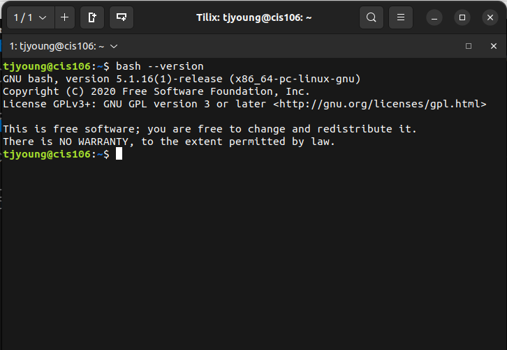
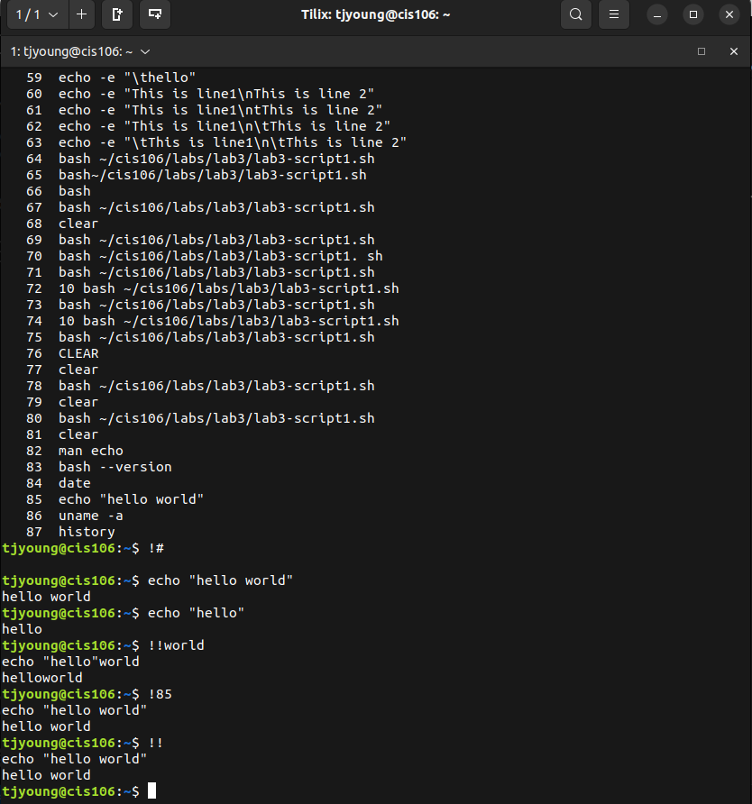
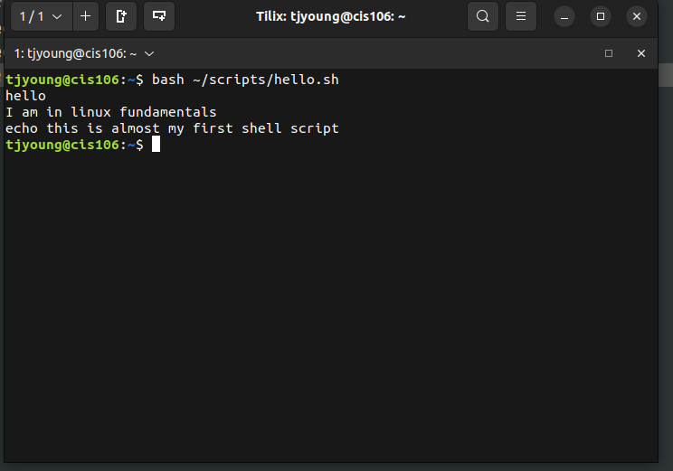
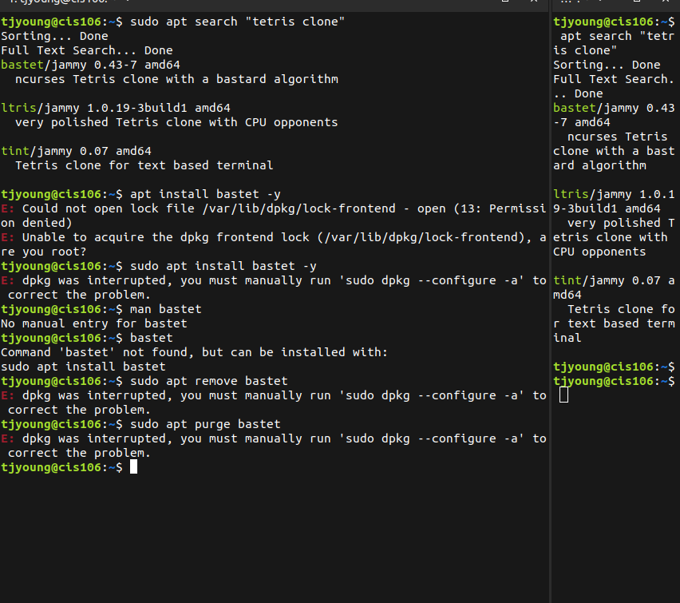

# week Report 3
## Completed work for week 3
* [lab3](../../labs/lab3/lab3.md) 
* [notes1](../../notes/notes1/notes1.md)
  
  ### Practice 2: Accessing the bash shell 
  

  ### Practice 3: Using the command history 
  
  
  ### Practice 4: My first shell script 
  
  
  ### Practice 5: Using man 
  

  ### Practice 6: using help option 
  

  ### Practice 7: cheat
  

  ### Practice 1: Managing software
  

  ### Practice 3: Managing software
  